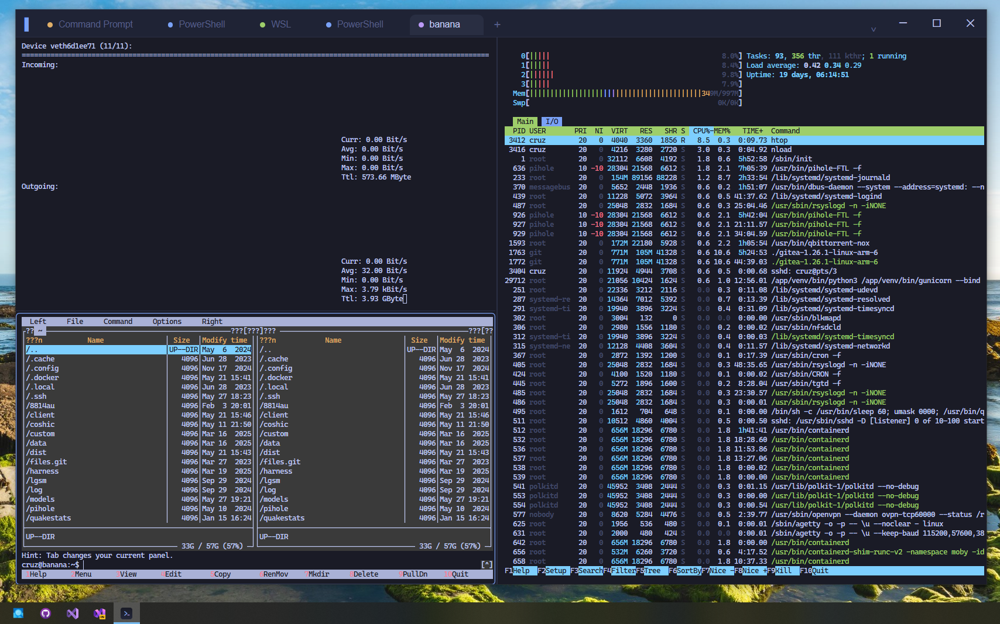
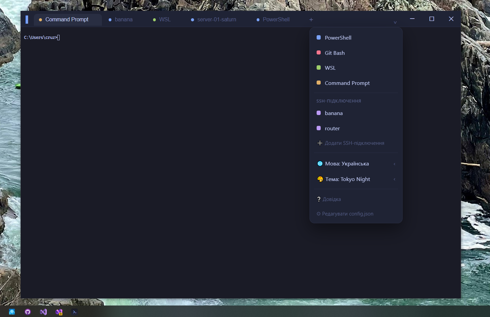
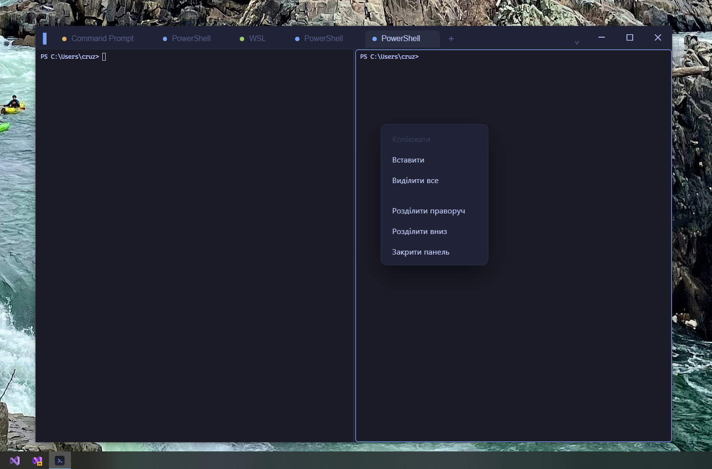
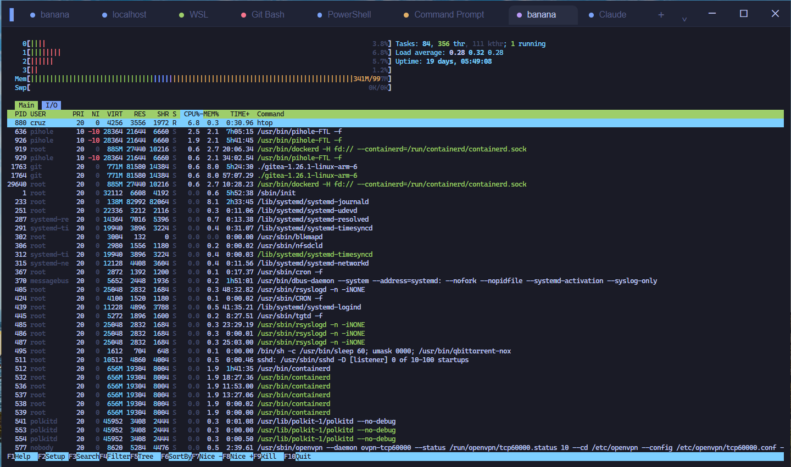

<h1 align="center">Abergin</h1>

<p align="center">
  A fast, modern terminal for Windows — tabs, split panes, SSH profiles &amp; themes.<br>
  Built with <strong>Tauri 2 (Rust)</strong> + <strong>xterm.js</strong>.
</p>

<p align="center">
  <a href="https://github.com/cruz-sketch/Abergin/releases"></a>
  <a href="LICENSE"></a>
  
  
  
</p>

<p align="center">
  <strong>English</strong> · <a href="README.uk.md">Українська</a>
</p>

Abergin (short from Aubergine, /ˈəʊ.bə.ʒiːn/) - a stylish, native terminal for Windows in the spirit of the default Linux console
/ Ghostty. It talks to shells directly through ConPTY (`portable-pty`) and stays
tiny (~1.3 MB installer) by using the system WebView2 instead of bundling Chromium.

## Screenshots

<p align="center">
  
</p>
<p align="center">
  
  
</p>
<p align="center">
  
</p>

## Features

- **Profiles** — auto-detects PowerShell, PowerShell 7, Git Bash, WSL, Command
  Prompt. Stored in `%APPDATA%\com.abergin.terminal\config.json` (editable from Settings → Advanced).
- **Bash keybindings** — PowerShell launches in `EditMode Emacs`, so `Ctrl+W`,
  `Ctrl+A/E`, `Ctrl+U/K`, `Ctrl+R` (history search), `Alt+B/F` work. Native in Git Bash / WSL.
- **Command history** — at the shell level (PSReadLine/readline) + 10 000-line scrollback.
- **Tabs** — multiple sessions, rename (double-click / menu), **drag-and-drop**
  reordering. Tabs, their active panes and launch directories are restored between launches.
  PowerShell, Git Bash, Command Prompt and WSL report directory changes, so a
  tab reopened after `cd` starts there. `Ctrl+Shift+T` and the + button open a
  new tab with the active pane's profile and directory.
- **Split panes** — a tab splits into a tree of panes (like tmux / Windows
  Terminal), each its own session; drag the dividers to resize; layout persists.
- **SSH manager** — save and edit connections (host/user/port/key) and connect in one
  click; uses the built-in Windows OpenSSH.
- **Explorer integration** — right-click a folder (or its background / a drive) →
  **"Open in Abergin"** and the terminal opens already in that directory. Toggle it
  from Settings (writes to `HKCU`, no admin rights needed). If Abergin is
  already running, it opens a new tab in the existing window.
- **Select-to-copy** + middle-click paste (Linux convention).
- **Settings** — an in-window panel for language, theme, font family and size,
  and Explorer integration, with an Advanced link to `config.json`. Font choices
  use fonts installed in Windows; a custom installed font name can be entered.
- **Search** — `Ctrl+Shift+F` finds text in the active pane's scrollback. Use
  Enter / Shift+Enter to move between matches.
- **Themes** — 6 built-in (Tokyo Night, Dracula, Gruvbox Dark, Nord, One Dark,
  Solarized Light); they restyle the whole app.
- **Rendering** — the DOM renderer is the default for stable text in rapidly
  repainted terminal apps. Set `"renderer": "webgl"` in `config.json` to opt in to GPU rendering.
- **Text zoom** — `Ctrl +/-/0` or `Ctrl`+wheel.
- **14 languages** — Ukrainian, English, Deutsch, Français, Español, Polski,
  Čeština, Lietuvių, Latviešu, Eesti, Norsk, Română (Moldova), Azərbaycan, 日本語.
  On first launch the language is picked from the OS locale (English otherwise),
  then changeable in Settings.
- **Help** — `F1`.
- **Look** — frameless window, custom title bar, solid background (acrylic dropped
  — it lags while dragging on Windows 10).

## Keyboard shortcuts

| Keys | Action |
|---|---|
| `Ctrl+Shift+T` | new tab in the active pane's directory |
| `Ctrl+Shift+W` | close pane (last one → tab) |
| `Ctrl+Tab` / `Ctrl+Shift+Tab` | switch tabs |
| `Alt+1…9` | jump to Nth tab |
| `Ctrl+Shift+D` / `Ctrl+Shift+E` | split pane right / down |
| `Alt+←↑↓→` | move focus between panes |
| `Ctrl+Shift+C` / `Ctrl+Shift+V` | copy / paste |
| `Ctrl+Shift+F` | search the active pane's scrollback (any keyboard layout) |
| `Ctrl + =` / `Ctrl + -` / `Ctrl + 0` | text zoom |
| `F1` | help |
| middle mouse button | paste |

> Everything else (`Ctrl+W`, `Ctrl+A`, `Ctrl+R`…) is forwarded to the shell.

## Develop & build

```powershell
npm install
npm test               # session restoration tests
npm run tauri dev      # dev mode (Vite + Rust, opens a window)
npm run tauri build    # installer → src-tauri\target\release\bundle\nsis\
```

> **Toolchain:** the build needs **MSVC** (the linker from Visual Studio), pinned
> in `rust-toolchain.toml`. The default `gnu` toolchain breaks the Tauri build
> (`error: export ordinal too large`). Node and WebView2 are also required
> (WebView2 is preinstalled on Windows 11 and most Windows 10 devices).

## Code signing (optional)

For the Microsoft Store MSIX build and submission checklist, see
[store/README.md](store/README.md). The app's [privacy policy](PRIVACY.md) is
also available here.

A plain `npm run tauri build` is **unsigned** and builds without any certificate,
so anyone can compile it.

To sign the `.exe` and installer:

1. Copy `src-tauri/tauri.signing.conf.example.json` →
   `src-tauri/tauri.signing.conf.json` (this file is gitignored).
2. Put your certificate's `certificateThumbprint` (from `Cert:\CurrentUser\My`).
3. Build:

   ```powershell
   npm run tauri:build:signed
   ```

A self-signed cert (`New-SelfSignedCertificate -Type CodeSigningCert`) is fine for
testing — valid only on machines where it's added to Trusted Root. To clear
SmartScreen on other machines you need a real certificate (Azure Trusted Signing /
OV / EV).

## Releases

Pushing a `v*` tag runs the GitHub Actions workflow (`.github/workflows/release.yml`),
which builds the (unsigned) Windows installer and uploads it to a **draft** GitHub
Release. To cut one, bump the version in `package.json`, `src-tauri/Cargo.toml` and
`src-tauri/tauri.conf.json`, then:

```powershell
git tag vX.Y.Z
git push github vX.Y.Z
```

Review the draft release on GitHub and publish it.

## App data

`%APPDATA%\com.abergin.terminal\`
- `config.json` — profiles, font, base theme.
- `state.json` — open tabs, pane layout and directories, active tab/pane, SSH
  connections, language, current theme, font size.

## Project layout

```
index.html, src/main.js, src/style.css  — frontend (xterm.js, UI, tabs/panes,
                                            shortcuts, themes, i18n, SSH, help)
src-tauri/src/pty.rs       — ConPTY sessions (spawn / read / write / resize / close)
src-tauri/src/config.rs    — profiles & config.json
src-tauri/src/state.rs     — state.json (get_state / save_state), ssh.exe path
src-tauri/src/lib.rs       — Tauri entry point, command registration
src-tauri/tauri.conf.json  — window & bundle config
```

## License

[MIT](LICENSE) © 2026 Cruz
