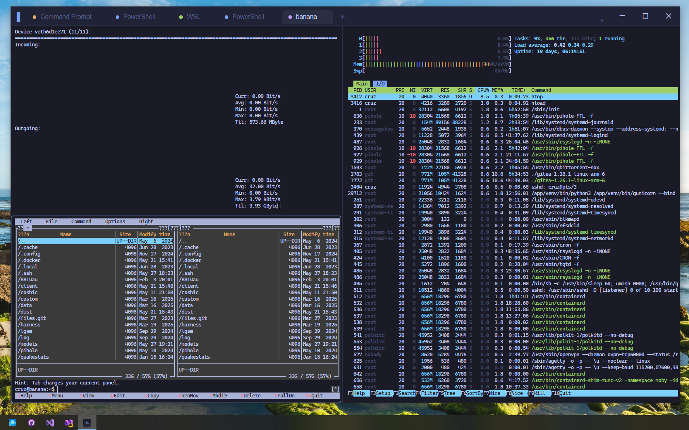
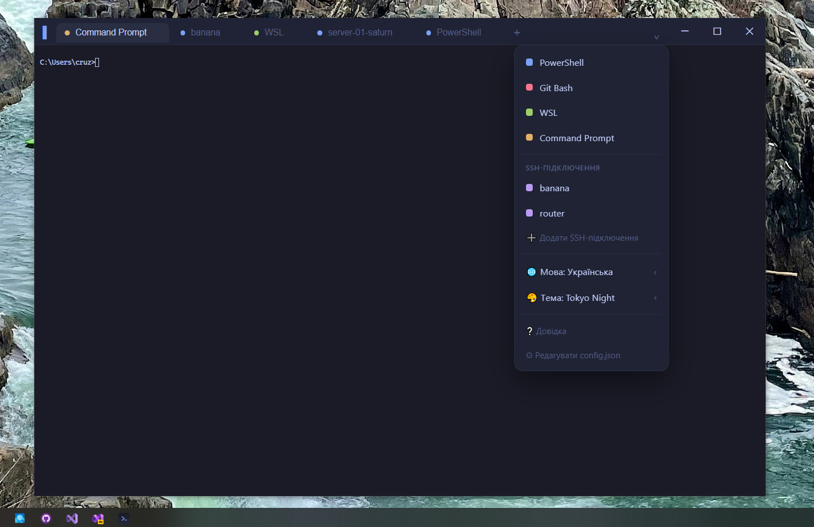
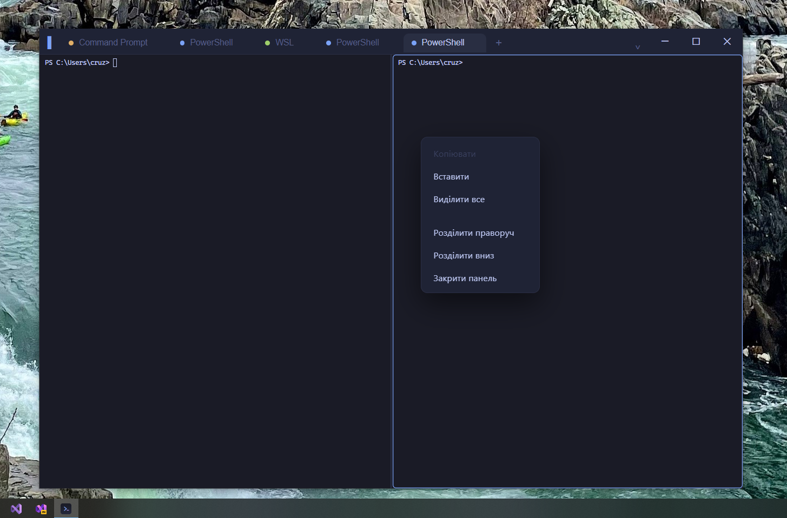
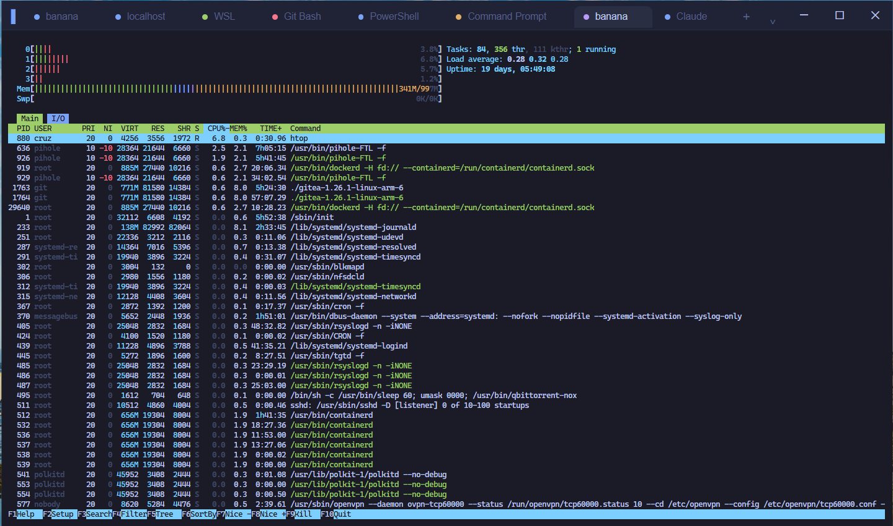

<h1 align="center">Abergin</h1>

<p align="center">
  Швидкий сучасний термінал для Windows — вкладки, split-панелі, SSH-профілі й теми.<br>
  Збудований на <strong>Tauri 2 (Rust)</strong> + <strong>xterm.js</strong>.
</p>

<p align="center">
  <a href="LICENSE"></a>
  
  
  
</p>

<p align="center">
  <a href="README.md">English</a> · <strong>Українська</strong>
</p>

Стильний нативний термінал для Windows у дусі дефолтної консолі Linux / Ghostty.
Працює напряму через ConPTY (`portable-pty`) і лишається маленьким
(інсталятор ~1.3 МБ), бо використовує системний WebView2, а не вбудований Chromium.

## Скріншоти

<p align="center">
  
</p>
<p align="center">
  
  
</p>
<p align="center">
  
</p>

## Можливості

- **Профілі** — автодетект PowerShell, PowerShell 7, Git Bash, WSL, Command Prompt.
  Зберігаються у `%APPDATA%\com.abergin.terminal\config.json` (редагується з меню `⌄`).
- **Bash-комбінації** — PowerShell стартує в `EditMode Emacs`, тож працюють
  `Ctrl+W`, `Ctrl+A/E`, `Ctrl+U/K`, `Ctrl+R` (пошук в історії), `Alt+B/F`.
  У Git Bash / WSL — нативно.
- **Історія команд** — на рівні шелу (PSReadLine/readline) + скролбек 10000 рядків.
- **Вкладки** — кілька сесій, перейменування (подвійний клік / меню), **drag-and-drop**
  для зміни порядку. Відновлюються між запусками.
- **Split-панелі** — вкладка ділиться на дерево панелей (як tmux / Windows Terminal),
  кожна — окрема сесія; роздільники тягнуться мишею; розкладка зберігається.
- **SSH-менеджер** — зберігай підключення (хост/користувач/порт/ключ) і підключайся
  одним кліком; використовує вбудований Windows OpenSSH.
- **Select-to-copy** + вставка середньою кнопкою (як у Linux).
- **Теми** — 6 вбудованих (Tokyo Night, Dracula, Gruvbox Dark, Nord, One Dark,
  Solarized Light); змінюють увесь інтерфейс.
- **Масштаб тексту** — `Ctrl +/-/0` або `Ctrl`+колесо.
- **Багатомовність** — 14 мов: українська, English, Deutsch, Français, Español,
  Polski, Čeština, Lietuvių, Latviešu, Eesti, Norsk, Română (Moldova),
  Azərbaycan, 日本語. При першому запуску мова визначається з локалі ОС
  (інакше — англійська); потім її можна змінити в меню.
- **Довідка** — `F1`.
- **Вигляд** — frameless-вікно, кастомний титлбар, суцільний фон (без acrylic — він
  лагає при перетягуванні на Windows 10).

## Гарячі клавіші

| Клавіші | Дія |
|---|---|
| `Ctrl+Shift+T` | нова вкладка |
| `Ctrl+Shift+W` | закрити панель (остання → вкладку) |
| `Ctrl+Tab` / `Ctrl+Shift+Tab` | перемикання вкладок |
| `Alt+1…9` | перейти на N-ту вкладку |
| `Ctrl+Shift+D` / `Ctrl+Shift+E` | розділити панель праворуч / вниз |
| `Alt+←↑↓→` | перехід між панелями |
| `Ctrl+Shift+C` / `Ctrl+Shift+V` | копіювати / вставити |
| `Ctrl + =` / `Ctrl + -` / `Ctrl + 0` | масштаб тексту |
| `F1` | довідка |
| середня кнопка миші | вставити |

> Решта комбінацій (`Ctrl+W`, `Ctrl+A`, `Ctrl+R`…) передаються в шел.

## Розробка та збірка

```powershell
npm install
npm run tauri dev      # режим розробки (Vite + Rust, відкриває вікно)
npm run tauri build    # інсталятор → src-tauri\target\release\bundle\nsis\
```

> **Тулчейн:** збірка вимагає **MSVC** (лінкер із Visual Studio). Зафіксовано в
> `rust-toolchain.toml`. Дефолтний `gnu`-тулчейн ламає збірку Tauri
> (`error: export ordinal too large`). Потрібні також Node і WebView2 (є в Win10/11).

## Цифровий підпис (опціонально)

Звичайна збірка `npm run tauri build` **не підписує** нічого і працює без
сертифіката — тож зібрати може будь-хто.

Щоб підписати `.exe` та інсталятор:

1. Скопіюй `src-tauri/tauri.signing.conf.example.json` →
   `src-tauri/tauri.signing.conf.json` (цей файл у `.gitignore`).
2. Впиши `certificateThumbprint` свого сертифіката (з `Cert:\CurrentUser\My`).
3. Збери:

   ```powershell
   npm run tauri:build:signed
   ```

Для тесту згодиться self-signed сертифікат (`New-SelfSignedCertificate -Type
CodeSigningCert`), валідний лише на машинах, де його додано в Trusted Root. Щоб
прибрати SmartScreen на чужих ПК — потрібен справжній сертифікат (Azure Trusted
Signing / OV / EV).

## Дані застосунку

`%APPDATA%\com.abergin.terminal\`
- `config.json` — профілі, шрифт, базова тема.
- `state.json` — відкриті вкладки + розкладка панелей, SSH-підключення, мова,
  поточна тема, розмір шрифту.

## Структура

```
index.html, src/main.js, src/style.css  — фронтенд (xterm.js, UI, вкладки/панелі,
                                            гарячі клавіші, теми, i18n, SSH, довідка)
src-tauri/src/pty.rs       — ConPTY-сесії (spawn / read / write / resize / close)
src-tauri/src/config.rs    — профілі та config.json
src-tauri/src/state.rs     — state.json (get_state / save_state), шлях до ssh.exe
src-tauri/src/lib.rs       — точка входу Tauri, реєстрація команд
src-tauri/tauri.conf.json  — вікно та налаштування бандла
```

## Ліцензія

[MIT](LICENSE) © 2026 Cruz
